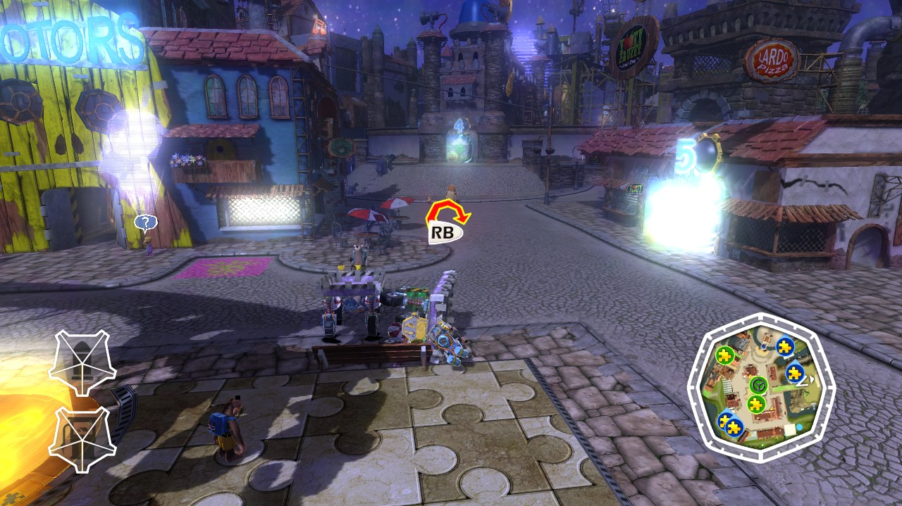
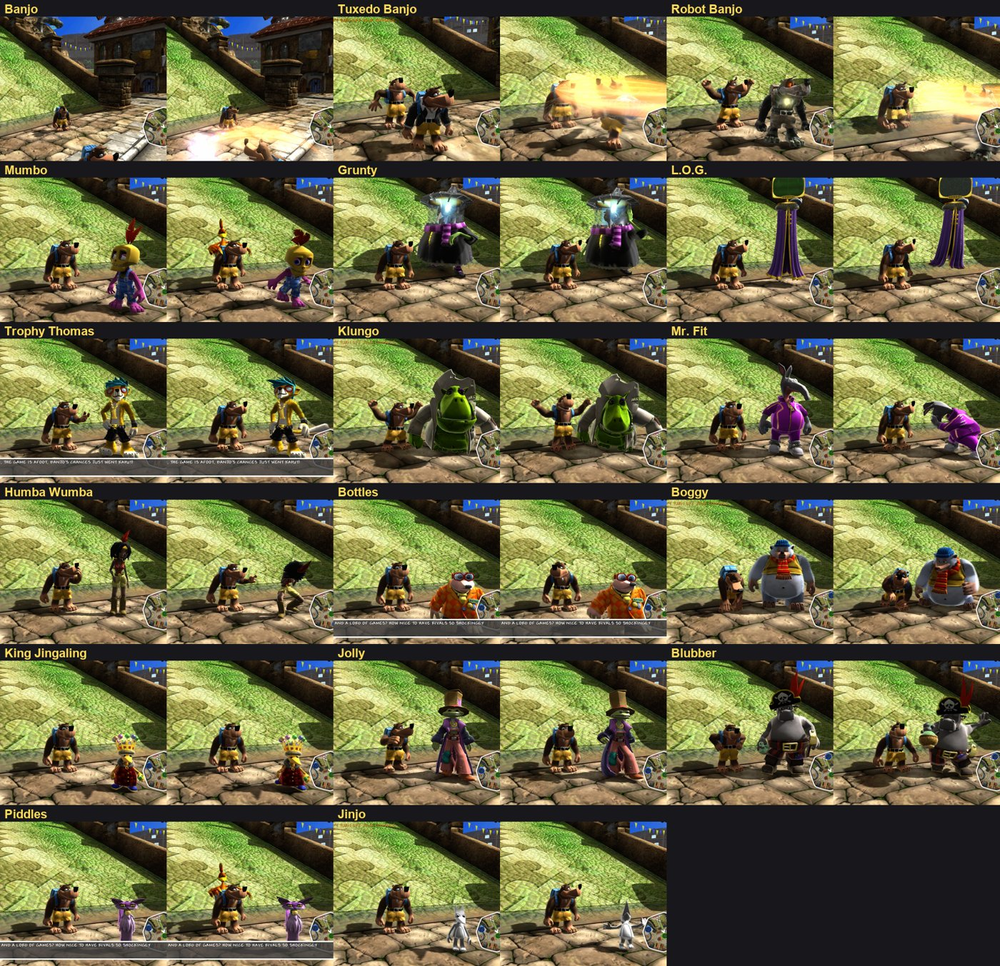
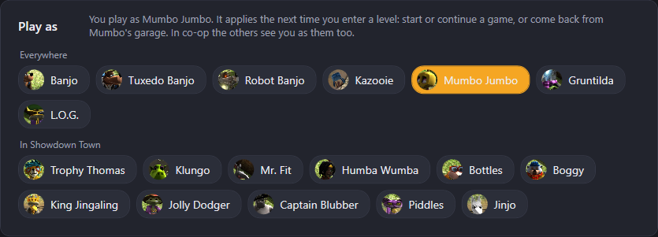
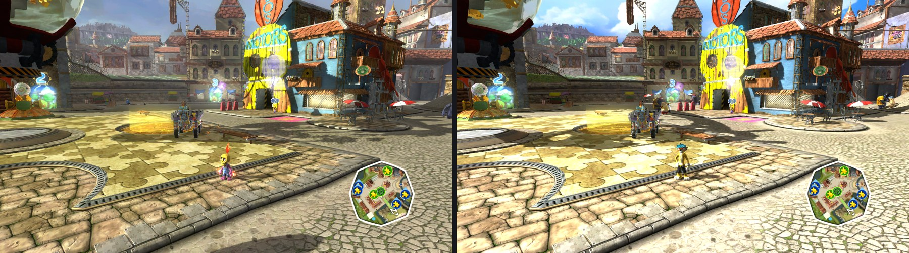
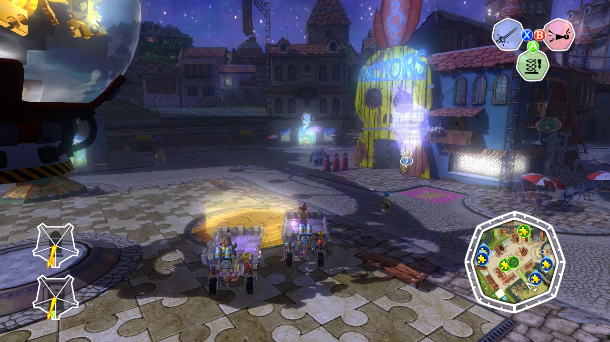
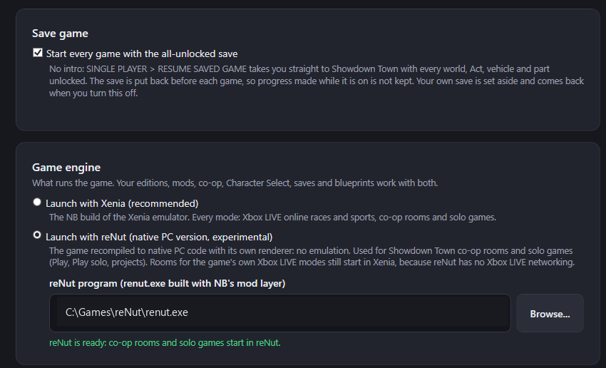
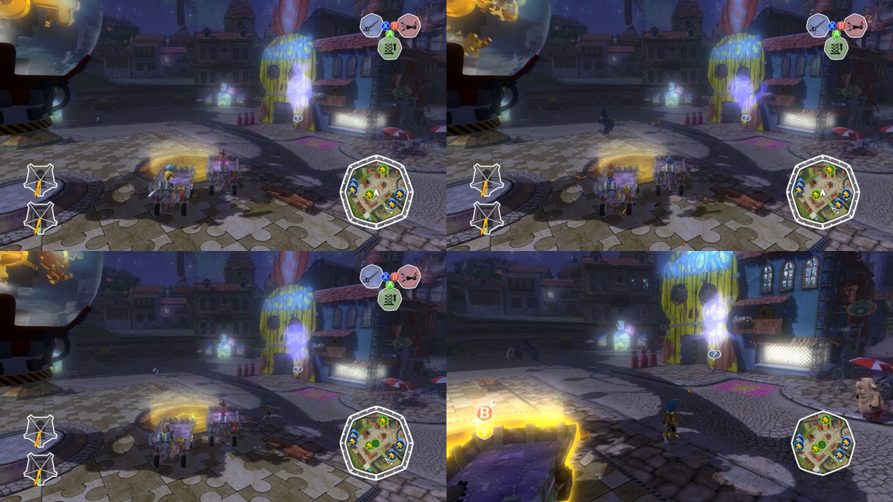

<p align="center">
  
</p>

<p align="center">
  <b>Play <i>Banjo-Kazooie: Nuts &amp; Bolts</i> with your friends again: online, in co-op, and with mods.</b><br>
  One app that runs the game, connects you through Steam (no port forwarding, no accounts, no servers to rent) and
  manages your mods: the game's own Xbox LIVE races and sports, single-player Showdown Town together, a mod library
  with tick-box tweaks, and your NB Studio projects.
</p>

<p align="center">
  <a href="../../releases/latest"></a>
  <a href="src"></a>
</p>

<p align="center">
  
  <br><i>Two PCs, one race: the host (left) and a friend (right) in the same Jiggosseum Speedway match.</i>
</p>

---

## Contents

- [What it does](#what-it-does)
- [What you need](#what-you-need)
- [Install](#install)
- [First start](#first-start)
- [Hosting a room](#hosting-a-room)
- [Joining a room](#joining-a-room)
- [In the game](#in-the-game)
- [Showdown Town co-op (preview)](#showdown-town-co-op-preview)
- [Character Select](#character-select)
- [Snowy Showdown Town](#snowy-showdown-town)
- [Mods, editions and tweaks](#mods-editions-and-tweaks)
- [Projects and NB Studio](#projects-and-nb-studio)
- [Playing with reNut (native PC version)](#playing-with-renut-native-pc-version)
- [Updates](#updates)
- [Troubleshooting](#troubleshooting)
- [How it works](#how-it-works)
- [Building from source](#building-from-source)
- [Credits and legal](#credits-and-legal)

---

## What it does

| | |
|---|---|
| 🏁 **Online matches** | The game's own Xbox LIVE parties, races, sports and team games, up to 4 players. Friends land in the host's party automatically. |
| 🏘️ **Showdown Town co-op** *(preview)* | Play the single-player game together: see each other's real vehicles in town, get out and walk around together, build and change vehicles at the same time, and fight: wrenches, weapons and torpedoes, with parts breaking off. |
| 🎭 **Character Select** | Play as Mumbo, Grunty, Kazooie, L.O.G., Tuxedo or Robot Banjo, and in Showdown Town as Trophy Thomas, Klungo, Humba Wumba, Piddles and more. In co-op the others see you as your character. |
| 🔧 **Mods & editions** | A mod library with categories (maps, vehicle parts, gameplay, visuals, sounds, tweaks, co-op) and tick-box tweaks such as *Unlimited parts* or *All parts unlocked*. Tick mods, build an edition, play it alone or host it. Mods that change the same world are combined asset by asset. Friends get missing mods from the host when they join. |
| 📁 **Your modded game** | Modded your game folder by hand in the past? **Add a modded game folder** turns it into a mod you can combine with others and play in co-op. |
| ❄️ **Snowy Showdown Town** | The first official map mod: Showdown Town under snow, with falling snow everywhere, holly and red-and-green bunting, and winter light and skies for every time of day. Combines with co-op. |
| ⚙️ **ULTRA Parts** | A bundled vehicle-parts mod: ULTRA Engine, Fuel, Ammo and Wheels, Plane Hull, Tiki and Fusion Reactor in Mumbo's Motors. |
| 🗂️ **Projects** | Your [NB Studio](https://github.com/weighta/NB-Studio-Banjo-Kazooie-Nuts-and-Bolts-World-Editor-) projects: NB Multiplayer installs and updates the editor, opens projects in it and turns them into mods. |
| 🖥️ **reNut** *(experimental)* | Play with [reNut](https://github.com/masterspike52/reNut), the game recompiled to native PC code, instead of Xenia: same editions, mods, co-op and Character Select (Settings > Game engine). |
| 💾 **All-unlocked save** | Skip the intro: start every game with everything unlocked (your own save is kept aside). |
| 🌐 **Steam connection** | Rooms through Steam's relay network: share a room code, nothing to configure. Home network and direct internet work too. |
| ⬆️ **Updates** | NB Multiplayer updates itself from this repository's releases (it asks first). |

## What you need

| | |
|---|---|
| 🎮 **The game** | Your own copy of *Banjo-Kazooie: Nuts & Bolts* (Xbox 360), **extracted to a folder**: the folder with `default.xex` and the `Bundle` folder. Everyone in a room must have the same version. |
| 💻 **A PC** | Windows 10 or 11 (64-bit) that runs the Xenia emulator (a DirectX 12 graphics card). |
| 🟦 **Steam** | Running and logged in, for the recommended "through Steam" connection. Any free Steam account works; you don't need to be Steam friends. |
| 🕹️ **A controller** | Xbox controllers work as they are; PlayStation 4/5 controllers work too (see [Troubleshooting](#troubleshooting)). |

Up to 4 players per room.

## Install

**1.** Download **`NB-Multiplayer-x.y.z.zip`** from the [latest release](../../releases/latest).

**2.** Right-click the zip → **Properties** → tick **Unblock** → **OK**, then extract it anywhere
(for example `Documents\NB-Multiplayer`). Keep the folder together: `NBMultiplayer.exe`, `steam_api64.dll` and the
`xenia`, `patches` and `saves` folders belong together.

**3.** Run **`NBMultiplayer.exe`**. If Windows says *"Windows protected your PC"*, click **More info → Run anyway**
(the app is not code-signed). It offers to create a desktop shortcut.

## First start

The **Play** page tells you what's missing. Open **Settings**:

<p align="center"></p>

1. **Player name**: letters and digits, up to 15 characters. It becomes your in-game profile name.
2. **Game folder**: click **Browse...** and choose the folder that contains `default.xex` and `Bundle`.
   NB Multiplayer only reads it; it never changes your game files.
3. *(Optional)* **Start every game with the all-unlocked save**: no intro, every world, Act, vehicle and part unlocked
   (see [Showdown Town co-op](#showdown-town-co-op-preview)).

Your profile and saves are stored in `%LOCALAPPDATA%\NB-Multiplayer` (Settings → *Open data folder*), separate from any
other Xenia you use.

## Hosting a room

One player hosts; everyone else joins. On the **Play** page, first pick the **edition** to play (*Vanilla* or one you
built under [Mods & editions](#mods-editions-and-tweaks)); **Play solo** plays it on your own without a room.

<p align="center"></p>

**1.** Under *Where are your friends?* choose:

| Option | When | Setup |
|---|---|---|
| **Anywhere, through Steam** *(recommended)* | Friends anywhere in the world | Nothing: Steam's relay network connects you. Steam must be running on every PC. |
| **On my home network** | Everyone on the same Wi-Fi/LAN | Nothing. |
| **Over the internet** | Without Steam | Forward **TCP 36000** and **UDP 36001** in your router to your PC, and allow NB Multiplayer through your firewall. *Test from the internet* checks it. |

**2.** Click **Start hosting**. NB Multiplayer checks your game files (the first time takes a few minutes), opens the
room and shows the **room code**, already copied to your clipboard:

<p align="center"></p>

**3.** Send the room code to your friends (Discord, Steam chat...). The game starts by itself; the *room* panel at the
bottom lists everyone who connects.

> Keep NB Multiplayer open while you play: it runs the room. *Close room* ends it.

## Joining a room

**1.** Paste the room code into **Room code or address** and click **Join**.

<p align="center"></p>

**2.** NB Multiplayer connects (through Steam for `NBS-` codes), switches to the host's
[edition](#mods-editions-and-tweaks) (building it, and getting any mod you lack from the host, when you don't have it
yet), checks that your game files match the host's and starts the game. If something differs it tells you exactly what
(for example *"vehicle parts library: 2 files"*).

## In the game

**1.** At the house menu go right to **MULTIPLAYER** and choose **Xbox LIVE**.

<p align="center"></p>

**2.** The very first time, the game asks *"Save game doesn't exist, start a new game?"*: choose **Yes**. You go straight
to the Xbox LIVE lobby.

<p align="center"></p>

**3.** **Host:** set **MATCH CHOICE** to **"Play a game with my party"**. Friends who open Xbox LIVE are added to your
party automatically, within a few seconds. A notice appears on screen: *"Joining ...'s party"*.

<p align="center">
  
  
</p>
<p align="center"><i>The same party seen by the host (left) and the friend (right). Only the host can start.</i></p>

> ⚠️ Don't press **B** on the party screen: it means *Leave party*.

**4.** **Host:** under **CHOSEN GAME** pick a race or a sport (**RB** switches between races and sports), then **START**
and confirm.

<p align="center">
  
  
</p>

**5.** Everyone loads into the match, picks a vehicle (or keeps the default) and plays.

<p align="center"></p>

## Showdown Town co-op (preview)

Play the **single-player game together**. Everyone plays their own save; NB Multiplayer shows the other players in your
Showdown Town in the vehicle they really drive, with Banjo at the wheel, steered to where they really are. You can bump into
each other, town vehicles break apart, and *Change Vehicle* / *Build Vehicle* work anywhere in town.

* **Every vehicle part is unlocked** in the co-op edition, whatever each player's save has: build endlessly in Mumbo's
  Motors, each player in their own garage, at the same time.
* **Their real vehicles**: each player's vehicle design (blocks, paint) is sent to the others, whose games rebuild it, so
  you see the Mk. 6, the taxi or the helicopter your friend drives. After a *Change Vehicle* the new vehicle appears a few
  seconds after they close the menu.
* **Damage you can see**: damaged parts of the other players' vehicles show the game's own warning colours (green, orange,
  red as the part gets weaker) and flash when hit. A part that breaks off their vehicle breaks off in every game, at the
  same spot, and lies in the street.
* **Police in sync**: the town's police follow the host's game, so every player sees the same units in the same places.
* **Shots in every game**: eggs, grenades, torpedoes and lasers a player fires leave their vehicle in everyone's game
  too (for show: only the real shot in the shooter's game deals the damage, so nobody is hit twice).
* **Fight each other**: weapon hits on the other player's vehicle (lasers, egg guns, explosions) are sent to their game
  and applied there by the game itself, so their vehicle takes the damage and parts break off and fall into the street.
* **The same time of day for everyone**: the host picks *Random, Morning, Midday, Afternoon* or *Night* in the co-op
  room panel, and every player's Showdown Town loads with it (a change applies the next time the town loads).
* **Up to 4 players**: each player sees up to three others. Their trolleys appear only while they are really in Showdown
  Town; anyone at the title screen, loading, in another world or in Mumbo's garage is not shown, and unused trolleys are
  invisible and pass-through.
* **Menus don't freeze the town**: with the pause menu, *Change Vehicle* or photo mode open, the world keeps running (as in
  the game's Xbox LIVE modes), so the other players keep driving through your town. Menu input never moves your vehicle.
* **On foot, together**: get out of your vehicle and the others see your Banjo (or your [character](#character-select)) walking, running, jumping and spinning
  the wrench where you really are, with the game's own animations. Wrench fights work: a hit knocks the other player's
  Banjo down in their game.
* **Changing vehicle**: while a player has *Change Vehicle* open, their vehicle stays where it is with the game's
  "vehicle edit" icon over it; a player in Mumbo's garage shows the Mumbo pad icon where they left town. The room panel
  shows what everyone is doing (in town, on foot, in the pause menu, taking photos, changing vehicle, in Mumbo's garage,
  not in town).
* **Rough-housing and flying**: vehicles really bump into each other (a ram shoves the other player's vehicle), flying
  up next to someone no longer drags their vehicle up with you, torpedoes lock onto the player they were fired at in
  every game, and parts that break off land where they should.
* **Blueprints are safe**: a saved vehicle with parts a game doesn't have (for example ULTRA Parts) no longer crashes
  *Your Blueprints*; the game shows its own warning and builds the vehicle without the missing parts. NB Multiplayer
  also keeps a backup of every vehicle you save and puts back any that go missing. Leaving Mumbo's garage without
  saving brings you back in the vehicle you built.
* **The room's settings apply to everyone**: the host's time of day and the host's *all-unlocked save* setting are
  given to every player who starts their game in the room (a friend without a save or with the option off still starts
  with everything unlocked; their own save comes back afterwards).
* **Restart any time**: if a player closes the game, **Play solo** (or **Start the game** in the co-op room panel) starts the
  room's game again and co-op picks it up by itself.
* **Smooth on real connections**: positions are predicted ahead by the measured network delay; in tests with 120 ms of
  latency, jitter, 5 % packet loss and reordering the trolleys stayed within about 2 units of the real players.
* **ULTRA Parts**: **Add co-op + ULTRA Parts** adds the ULTRA Engine, Fuel, Ammo and Wheels, the Plane Hull, the Tiki and
  the Fusion Reactor to Mumbo's Motors for everyone in the room. Showdown Town itself stays as it is.

<p align="center"></p>
<p align="center"><i>The host's game: their own trolley (left) and the friend's trolley (right), moving wherever the friend drives in their own game.</i></p>

<p align="center">
  
  
</p>
<p align="center"><i>Fighting: a laser hit on the friend's trolley (left) is applied in the friend's own game, where parts of their vehicle break off (right).</i></p>

<p align="center"></p>
<p align="center"><i>On foot: the friend got out of their vehicle and walks around your town (bottom left), wrench and all.</i></p>

<p align="center">
  
  
</p>
<p align="center"><i>Mumbo's Motors in the co-op edition: every part unlocked, including every weapon (left), and the ULTRA parts (right).</i></p>

**1.** **Mods & editions** → **Add co-op edition** (or **Add co-op + ULTRA Parts**). Friends who join get the same edition
automatically. (If you have the co-op edition of an older NB Multiplayer, the button says **Update co-op edition**.)

**2.** Host: on the **Play** page choose the edition **Showdown Town Co-op**, then **Start hosting** (Steam recommended).
Friends join with the room code as usual. The room panel lists everyone who is synced and how many players each game shows:

<p align="center"></p>

**3.** In the game: **SINGLE PLAYER** → load your save, or start a new game and play until you reach Showdown Town.
No save yet, or want everything unlocked? **Settings > Start every game with the all-unlocked save**: **RESUME SAVED GAME**
then goes straight to Showdown Town with every world, Act, vehicle and part unlocked (your own save is set aside and comes
back when you turn the option off).
As soon as two players are in town, each sees the other.

> **Preview limits:** ramming and spikes only hurt in each player's own game (the bump itself happens in both), the
> townsfolk crowds are each game's own (they are random in every game), and crates, Acts and story progress are not
> shared yet. *Build Vehicle* takes a player to Mumbo's garage, a separate level: the others see a Mumbo icon where they
> left town until they are back.
> Everyone in a co-op room needs the same NB Multiplayer version (2.0 or newer).

## Character Select

<p align="center"></p>
<p align="center"><i>Every playable character in Showdown Town, beside Banjo.</i></p>

Play as someone else. The **Character Select** mod adds 17 characters, each moving with their own animations: walking,
running, jumping and the wrench spin.

| Where | Characters |
|---|---|
| Everywhere | Tuxedo Banjo, Robot Banjo, Kazooie *(Banjo's backpack walking on its own; Kazooie pops out for the wrench spin)*, Mumbo Jumbo, Gruntilda, L.O.G. |
| Showdown Town | Trophy Thomas, Klungo, Mr. Fit, Humba Wumba, Bottles, Boggy, King Jingaling, Jolly Dodger, Captain Blubber, Piddles, Jinjo *(elsewhere you are Banjo: their data only exists in the town)* |

**1.** Use an edition with Character Select: **Add co-op edition** includes it, or tick *Character Select* in
**Mods & editions** for any edition.

**2.** On the **Play** page, pick your character in the **Play as** card.

<p align="center"></p>

**3.** Play. The character applies the next time you enter a level: start or continue a game, or come back from Mumbo's
garage. You can change it while the game runs.

<p align="center"></p>
<p align="center"><i>Playing as Mumbo (left) and as Trophy Thomas (right).</i></p>

**In co-op** every player can be someone else, and the others see them as that character, driving and on foot:

<p align="center"></p>
<p align="center"><i>The host plays as Mumbo (in the trolley); the friend got out as Trophy Thomas (in the street).</i></p>

> Characters keep Banjo's size for collisions, so Grunty clips through things and small characters sit a little high
> in the seat. A few characters have no animation for some of Banjo's actions and just stand (L.O.G. drives standing up).
> Fat Banjo is not included: his model only exists in the intro.

## Snowy Showdown Town

<p align="center"></p>

**Snowy Showdown Town** ships with NB Multiplayer as an official mod (*Maps & worlds*). Tick it under
[Mods & editions](#mods-editions-and-tweaks) and build an edition, alone or together with **Showdown Town Co-op**,
**ULTRA Parts** and any tweaks:

* **Snow everywhere**: deep snow on the streets, squares and hills, snow-dusted cobbles and jigsaw paving with snow
  packed into the gaps, snow-covered roofs, frosted trees and benches.
* **Christmas**: red-and-green bunting across the streets, holly garlands with red berries on the walls, and a snowy
  painted backdrop in the theatre.
* **Falling snow** all over town: the snowfall follows the camera, so it snows wherever you drive or walk.
* **Winter light, fog and skies** for every time of day: a pale morning, a grey-white snowy midday, a lilac dusk and a
  starry blue night, with the far hills fading into winter mist.

<p align="center"></p>
<p align="center"><i>Mumbo's Motors in the morning, at midday, at dusk and at night.</i></p>

<p align="center"></p>
<p align="center"></p>
<p align="center"><i>The original town (left) and Snowy Showdown Town (right), at midday and at night.</i></p>

<p align="center">
  
  
</p>

<p align="center"></p>
<p align="center"><i>Snowy Showdown Town + Co-op: the friend's trolley (ahead) drives through your snowy town.</i></p>

The mod was made the way many players mod: by changing a copy of the game folder by hand, then turning it into a mod
with **Add a modded game folder** / NB Studio's **Create Patch from a Modified Game Folder**. Its build script and the
research behind the snow, light and fog are in the
[NB Studio repository](https://github.com/weighta/NB-Studio-Banjo-Kazooie-Nuts-and-Bolts-World-Editor-) (`snow/`).

## Mods, editions and tweaks

**Mods** change the game: new maps, vehicle parts, gameplay, looks, and small **tweaks**. Every mod has a category
(*Maps & worlds, Vehicle parts, Gameplay & scripts, Textures & visuals, Sounds & music, Tweaks, Co-op & multiplayer*)
shown as a badge and used as a filter. An **edition** is your game with the mods you ticked, like a mod profile: tick
mods, press **Build an edition**, then host it or play it alone with **Play solo** on the Play page.

<p align="center"></p>

<p align="center"></p>
<p align="center"><i>The mod library: category filters, badges, built-in tweaks and the build bar for the ticked mods.</i></p>

* **Built-in tweaks**: the game-executable mods researched for NB Studio are tick boxes: *Unlimited parts (2000),
  Bigger world edge, No world-edge reset, Bigger garage, Longer draw distance, Change vehicles in town, Breakable town
  vehicles, Jumping AI vehicles, All parts unlocked, Developer main menu* and more. They combine with each other and
  with any mod.
* **Add a mod (.nbpatch)**: mods made with
  [NB Studio](https://github.com/weighta/NB-Studio-Banjo-Kazooie-Nuts-and-Bolts-World-Editor-) (or by friends) go into
  your mod library.
* **Add a modded game folder**: a game folder you changed by hand (replaced bundles or textures, a hex-edited
  `default.xex`) becomes a mod. NB Multiplayer compares it with the original game (it knows the size and SHA-256 of
  every original file), takes the differences against a clean copy (your game folder, or one you choose), recognises
  known executable tweaks by name and picks the category for you. If your game folder *is* the modded one, it offers
  to use the clean copy as your game folder from now on, so your changes become a mod you can tick, combine and share.

<p align="center"></p>
* **Change mods** on an edition ticks its mods so you can add or remove some and rebuild it.
* **Rooms share mods**: everyone in a room plays the host's edition. A friend who lacks one of its mods gets it from
  the host's room when they join (through Steam too) and NB Multiplayer builds the same edition for them.
* Editions are built next to NB Multiplayer; unchanged game files are linked, not copied, and your own game folder is
  never modified.
* **Mods combine asset by asset**: when two mods change the same game file, each mod's changed assets (textures,
  models, markers, scripts, vehicle parts) are taken from that mod. Only two mods changing the *same asset* differently
  is a conflict, and NB Multiplayer names it (for example *"Mod A" and "Mod B" both change
  aid_marker_banjox_showdowntown_main*). Tweaks always combine.
* **Co-op is a layer**: Showdown Town Co-op adds its puppet trolleys as world edits that are replayed on top of the
  other mods, so co-op works on any Showdown Town: vanilla, snowy, or your own.
* The Mods page shows the newest version of each mod; older versions stay available for editions that use them.
* A **mod depot** (browse and download community mods, share your own) is in development.

## Projects and NB Studio

The **Projects** page lists your NB Studio projects (NB Studio adds every project you open). **Get NB Studio** downloads
the editor from GitHub and keeps it up to date; **Open in NB Studio** opens a project in it; **Play** runs the project
with its executable tweaks; **Make a mod** turns it into a mod for your library, with a name, version, category and
description, and saves the `.nbpatch` file to share in the project's `mods` folder. **New project** makes a copy of
your game for NB Studio to edit.

<p align="center"></p>

## Playing with reNut (native PC version)

[reNut](https://github.com/masterspike52/reNut) is *Nuts & Bolts* recompiled to native PC code with its own renderer: no
emulator. NB Multiplayer can start your games with it instead of Xenia: **Settings > Game engine > Launch with reNut**,
then choose your `renut.exe`.

<p align="center"></p>

Everything works the same:

- **Editions and mods**: reNut reads the edition's game folder, so world, texture, part and sound mods work as they are.
- **Game-code mods** (co-op, Character Select, Change Vehicle in town, the tick-box tweaks): reNut needs to be built with
  **NB's mod layer** ([renut-nb](renut-nb)), which runs a mod's patched code wherever it is in the game's memory. One
  build plays every edition, mods on or off. For your own game folder and NB Studio projects NB Multiplayer writes the
  mods into the running game, like Xenia's patch files.
- **Co-op and Character Select**: they connect to reNut exactly like to Xenia. Tested with two players in one room:
  each sees the other's vehicle and character, driving and on foot, with the room's time of day.
- **Saves and blueprints**: in `data\renut` (reNut's profile); the all-unlocked save and the blueprint vault work there too.
- **Controllers**: reNut's own (Xbox and PlayStation controllers through SDL, or keyboard and mouse).

<p align="center"></p>
<p align="center"><i>Co-op in reNut: the host as Mumbo and the friend as Trophy Thomas, at night; the friend got out and walks (right).</i></p>

Limits: rooms for the game's own **Xbox LIVE** modes (online races and sports) still start in Xenia, because reNut has no
Xbox LIVE networking. reNut is young: the title screen can crash now and then (a timing race in the game's own code that
reNut exposes); NB Multiplayer starts it again by itself when that happens.

**Getting reNut with NB's mod layer**: NB Multiplayer does not include reNut (it contains code translated from the game).
Build it from reNut's source with the [renut-nb](renut-nb) kit: `apply.cmd`, then `build_renut.cmd` (the kit's README lists
what you need: Visual Studio 2022, the ReXGlue SDK, Clang, and your own copy of the game).

## Updates

NB Multiplayer checks this repository's releases when it starts (you can turn that off in Settings). When a new version
is out, a banner offers **Update now**, **What's new**, **Later** or **Skip this version**. Updating keeps your settings,
profile, saves and editions.

<p align="center"></p>

<p align="center"></p>

## Troubleshooting

| Problem | Fix |
|---|---|
| *"Steam is not available"* | Start Steam and log in, then try again. Steam shows you as playing **"Spacewar"**: that's Valve's public test app that NB Multiplayer uses for its connections. |
| *"Could not reach the host through Steam"* | Check the code; the host's NB Multiplayer must be open with the room started, and Steam running on both PCs. |
| Friend can't join on *home network / internet* | Something blocks incoming connections on the host: Windows Firewall, Portmaster, or an antivirus firewall must allow **NBMultiplayer.exe**. For internet play the router must forward TCP 36000 and UDP 36001. The hosting page shows a warning when this PC refuses connections. |
| *"Your game files differ from the host's"* | Use the same game version and the same edition. The message lists which kind of files differ. |
| Friend stays in their own party | Make sure the host is already in the Xbox LIVE lobby; the friend can back out to the house menu and open Xbox LIVE again. |
| PlayStation controller acts twice / as two players | DS4Windows or Steam's PlayStation support is also active: close them, or enable *Hide DS4 Controller* in DS4Windows. |
| A player drops back to their own party while a match loads | Rare; start the match again. |
| *"Your mods don't match the host's"* when joining | Your selected edition has other mods than the host's. **Match the host's mods** gets their mods (from the room) and switches you to the same edition; **Join anyway** keeps yours (the games may not join or may go out of sync). If the host changes mods while the room is open, starting the game again asks again. |
| Co-op: the time of day or the all-unlocked save differs | Both are the room's settings and apply when a game starts in the room: close the game and press **Play solo** (or **Start the game** in the co-op room panel) to restart it with them. |
| Co-op: I can't see my friend in town | Both of you must play the co-op edition (the room panel shows *Co-op (2 players)*) and be in Showdown Town; a player in Mumbo's garage shows as a Mumbo icon. |
| Co-op: pressing X warps instead of firing | You are on a warp pad or at a world door: drive off it first. |
| *"Your game files differ from the host's"* | The message says whose game folder is not the original game (and which files). Point **Settings > Game folder** at an unmodified copy of the game; your changes can become a mod with **Add a modded game folder**. If both folders are original, delete the edition in Mods & editions and join again. |
| Editions take a lot of disk space | Editions share the game's files with your game folder (hard links), which needs the same drive. Since 1.7.1 editions go next to your game folder; **Settings > Disk space > Free up space** rebuilds older ones there. |
| "These mods change the same things" | Two ticked mods change the same asset (the message names it), for example two mods that both edit the town's markers. Untick one of them. |
| A friend on NB Multiplayer 1.5 or older sees no puppets | Co-op 1.2 needs NB Multiplayer 1.6: everyone in the room should update (About & updates). |
| Something else | Send `%LOCALAPPDATA%\NB-Multiplayer\data\xenia.log` and `steam.log` from both PCs with an [issue](../../issues). |

## How it works

```
 Friend's PC                                    Host's PC
 ┌──────────────────────────┐   Steam relay    ┌──────────────────────────────┐
 │ Xenia (NB build)         │  ◄────────────►  │ NB Multiplayer               │
 │  game's Xbox LIVE code   │  (or direct      │  room server  (TCP 36000)    │
 │      │ localhost         │   TCP/UDP)       │  game relay   (UDP 36001)    │
 │ NB Multiplayer (tunnel)  │                  │ Xenia (NB build) ─ the game  │
 └──────────────────────────┘                  └──────────────────────────────┘
```

* The game runs in an **NB build of Xenia Canary netplay** (by AdrianCassar), which emulates Xbox LIVE against a
  server. NB Multiplayer **is** that server: a small in-memory implementation of the Xenia web services API running on
  the host's PC (sessions, players, QoS, friends).
* **Game traffic** (the game's own peer-to-peer packets) goes through a relay on the host: every player gets a virtual
  address (`10.77.0.N`), and per-session security associations are emulated (`10.78.x.y`). Getting these right is what
  makes Nuts & Bolts parties and matches stay together (see [xenia/](xenia)).
* **Steam**: joiners run a local tunnel (`127.0.0.1:36000/36001`) that carries everything over a Steam Networking
  Sockets connection (Steam Datagram Relay) to the host's NB Multiplayer, so nobody opens ports.
* **Room codes**: `NB-...` codes contain the host's IP address and port, `NBS-...` codes the host's Steam ID; both end
  with a fingerprint of the host's game files (SHA-256 of `default.xex` and every bundle) so mismatches are caught early.
* **Party joining** is automatic: the NB Xenia build befriends everyone in the room and accepts the host's invite as
  soon as you open Xbox LIVE.
* **Showdown Town co-op** runs each player's own single-player game. NB Multiplayer reads each player's vehicle 30 times
  a second (only while their game is in Showdown Town; the running level, loading screen and menus are read from the
  game's memory) and steers a stand-in vehicle (a "puppet" trolley of the co-op edition) to the same place in the
  other games about 120 times a second, predicted ahead by the network delay. Unused puppets are made invisible and
  pass-through (draw flag and collision layer). Executable mods keep the world running in menus and give everyone the
  room's time of day. A small executable mod logs weapon hits on puppets instead of applying them; NB Multiplayer sends them to that
  player's game, where the game's own damage code applies them (so parts break off naturally).
* **Mods** are `.nbpatch` files: differences against the original game files, no game data. An edition applies a list
  of mods (its recipe) to a linked copy of your game; executable mods of several mods are merged into one `default.xex`.
  Files that several mods change are merged asset by asset first; mods can also carry **world edits** (instructions
  such as "copy this vehicle into the town" or "add this AI route"), replayed after every mod's files.
* **Modded folders** are compared with a list of the size and SHA-256 of every original game file (shipped with the
  app, no game data); the clean copy only provides the original bytes of the changed files.

## Building from source

All the code is in this repository. Requirements: Windows 10/11 and the [.NET 9 SDK](https://dotnet.microsoft.com/download).

```bash
git clone https://github.com/weighta/NB-Multiplayer.git
cd NB-Multiplayer
dotnet build NBMultiplayer.sln -c Release
```

The app is `src/NB.Multiplayer/bin/Release/net9.0-windows/NBMultiplayer.exe`. A release build like the download:
`dotnet publish src/NB.Multiplayer -c Release -r win-x64 --self-contained true -p:PublishSingleFile=true -p:IncludeNativeLibrariesForSelfExtract=true`.

| Folder | What it is |
|---|---|
| `src/NB.Core` | The shared library: every game file format (CAFF bundles, xcompress, textures, models, markers, scripts, Havok collision, XEX), workspaces, patches and mod merging, executable mods, the room server and co-op sync |
| `src/NB.Multiplayer` | NB Multiplayer (WPF): rooms, Steam, editions, mod library, co-op, Character Select |
| `src/NB.Studio` | NB Studio (WinForms + OpenGL): the world editor |
| `src/NB.Cli` | `NB.Cli.exe`, the command-line tool used by the build scripts and tests |
| `renut-nb/` | NB's mod layer for reNut (interpreter, virtual controller, launch options, a game fix) and its build scripts |
| `coop/`, `charsel/`, `snow/` | Recipes that rebuild the bundled mods from your own copy of the game (`sh coop/build.sh`, `sh charsel/build.sh`, `sh snow/build.sh`; they need NB.Cli built in Release and Python). Set `NB_GAME` to your untouched game folder. Their output in `*/dist/` is bundled into NB Multiplayer when present. |

NB Studio, the world editor, lives in its own repository,
[NB Studio](https://github.com/weighta/NB-Studio-Banjo-Kazooie-Nuts-and-Bolts-World-Editor-) (same NB.Core).

* **The Xenia build**: apply [`xenia/nb-xenia-netplay.patch`](xenia/nb-xenia-netplay.patch) to
  AdrianCassar/xenia-canary `netplay_canary_experimental` at commit `6dbaa1f`; see [xenia/README.md](xenia/README.md).

## Credits and legal

* NB Multiplayer by **weighta**. MIT license ([LICENSE](LICENSE)).
* [Xenia](https://github.com/xenia-project/xenia) / [Xenia Canary](https://github.com/xenia-canary/xenia-canary) and
  the [netplay fork by AdrianCassar](https://github.com/AdrianCassar/xenia-canary) (BSD license, included as
  `xenia/LICENSE-xenia.txt` in the release).
* Steam networking through [Facepunch.Steamworks](https://github.com/Facepunch/Facepunch.Steamworks) (MIT) and Valve's
  Steamworks API (`steam_api64.dll`, redistributable).
* *Banjo-Kazooie: Nuts & Bolts* is © Microsoft and Rare. Unofficial fan project, not affiliated with or endorsed by them,
  Valve or the Xenia project. No game files are included; you need your own copy of the game.
